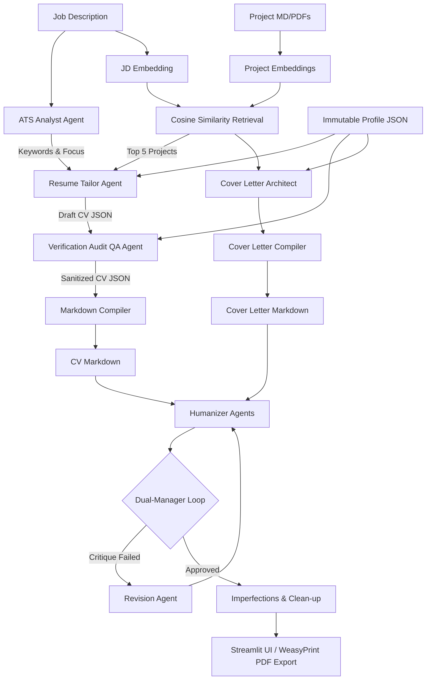

# Project Summary: Nexus CV Tailor

A professional, multi-agent AI system designed to automatically tailor CVs and Cover Letters for specific job descriptions while enforcing absolute factuality, human-like styling, and ATS optimization.

---

## 🎯 Target of the Project

The core goal of **Nexus CV Tailor** is to streamline the job application process by dynamically and authentically tailoring resumes and cover letters to target roles. It addresses major pain points in AI-assisted document writing:

1. **ATS Alignment:** Extracting critical keywords and structural focuses from job descriptions to ensure resumes pass Automated Tracking Systems.
2. **Strict Factuality (No Hallucinations):** Preventing the AI from inventing skills or achievements by validating all outputs against an immutable user profile and verifiable project databases.
3. **Adversarial AI Refinement:** Circumventing robotic phrasing and AI-detector highlights through iterative multi-agent critiques and natural language humanization.
4. **Seamless Export:** Providing an immediate, user-friendly interface to upload project files, parse data, and export print-ready PDFs.

---

## ⚙️ Technical Architecture & Orchestration

The project utilizes a modular, multi-agent pipeline orchestrating several specialized LLM agents and semantic search steps:

### 1. Vector Retrieval (Semantic Search)
* **File Processing:** Extracts text from uploaded project files (`.md` or `.pdf`) using `PyPDF`.
* **Embeddings:** Generates embeddings for each project block and the job description using Google's `gemini-embedding-001` model.
* **Cosine Similarity:** Performs a vector similarity comparison using `NumPy` to retrieve the top 5 most relevant projects matching the target job description.

### 2. Multi-Agent Pipeline
* **ATS Keyword Analyst Agent (`ats.py`):** Extracts core role focuses and the top 8 technical keywords.
* **Resume Tailor Agent (`resume_tailor.py`):** Integrates the user profile, job description, and retrieved projects to generate a structured CV JSON matching a strict schema.
* **Verification Audit Agent (`verification_audit.py`):** Acts as an independent QA editor. It cross-checks the tailored CV against the immutable profile and deletes any hallucinated tools, metrics, or experiences.
* **Cover Letter Architect Agent (`cover_architect.py`):** Composes a professional cover letter incorporating relevant experience.
* **Compilers (`compiler.py`, `cover_compiler.py`):** Converts the structured CV/Cover Letter JSONs into clean, structured Markdown.
* **Humanizers (`humanizer.py`, `cover_humanizer.py`):** Rephrases robotic sentence starters, excessive jargon, and unnatural flows.
* **Evaluation Loop (Dual-Manager System):**
  * **Quality Manager (`quality_manager.py`):** Assures that ATS keywords are included naturally and the formatting matches rules.
  * **Anti-AI Guard (`anti_ai_guard.py`):** Detects typical LLM patterns, excessive parallelism, or over-optimized phrases.
  * **Revision Agent (`revision.py`):** If either manager rejects the draft, critiques are combined and sent here for adjustment (runs up to 3 iterative loops).
* **Imperfections Agent (`imperfections.py`):** Introduces minor stylistic variations (e.g., varying bullet punctuation and avoiding hyper-parallel structures) to give the documents an authentic, human-made quality.

### 3. PDF Rendering
* Conversions are managed via `WeasyPrint`, injecting custom CSS configurations (font layout, page sizing, alignment parameters, margins, floating elements) to export standard A4 print-ready PDFs.

---

## 🛠️ Technology Stack

* **Frontend:** Streamlit
* **LLM Engine & API:** Google GenAI SDK (`gemini-2.5-flash`, `gemini-embedding-001`)
* **Vector Math:** NumPy (Cosine Similarity)
* **Data Parsing:** PyPDF (PDF text extraction), Pydantic/Structured Output JSON Schemas
* **Document Compilation:** Markdown & WeasyPrint (HTML to PDF)
* **Styling & Templates:** CSS & Jinja2-style document layouts
